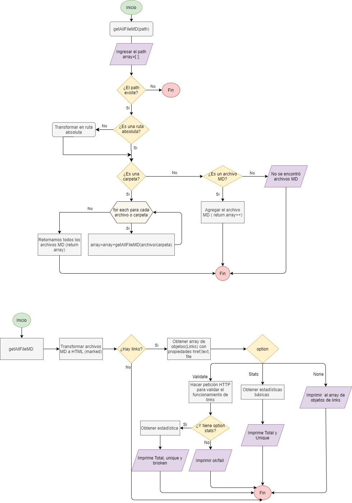

<br />
<p align="center">
  <a href="https://github.com/wendy-gs/LIM013-fe-md-links/blob/master/README.md">
    
  </a>
  <h1 align="center">&#60wendy-gs&#62/md-links</h1>
</p>

## Índice

* [1. Sobre el proyecto](#1-Sobre-el-proyecto)
* [2. Diagrama de flujo](#2-resumen-del-proyecto)
* [3. Instalación](#3-objetivos-de-aprendizaje)
* [4. Uso](#4-consideraciones-generales)
* [5. Contacto](#5-criterios-de-aceptación-mínimos-del-proyecto)

***

## 1. Sobre el proyecto  🔍

Este módulo nos permite analizar todos los links que se encuentre en archivos de formato [Markdown](https://es.wikipedia.org/wiki/Markdown) para porder verificar si son válidos o se encuentran rotos y reportar algunas estadísticas  (total de links encontrados, total de links únicos y total de links rotos).

## 2. Diagrama de flujo  ✍



## 3. Instalación  💻

~~~
npm install wendy-gs-md
~~~

## 4. Uso 🖱

Usaremos el comando md-links para ejecutar el programa

```sh
wendy-gs-md md-links <path> <options>
```
### Argumentos

* `path`: Ruta absoluta o relativa al archivo o directorio. 
* `options`:  No es obligatorio el ingreso de este valor, las opciones disponibles son : 
  - `--validate`: Válida si los links estan funcionando.
  - `--stats`: Muestra el total de links y los links únicos.
  - `--validate` `--stats`: Muestra total de links, links únicos y total de links rotos .

✔ **Muestra todos links encontrados de archivos .md**

```sh
wendy-gs-md md-links <path>
```
#### Ejemplo
Imagen

✔ **--validate / -v : Muestra la validacion de los links**

```sh
wendy-gs-md md-links <path> --validate
```
#### Ejemplo
Imagen

✔ **--stats / -s : Muestra total de links y únicos**
```sh
wendy-gs-md md-links <path> --stats
```
#### Ejemplo
Imagen

✔ **--stats --validate: Muestra total de links, únicos y rotos**
```sh
wendy-gs-md md-links <path> --stats --validate
```
#### Ejemplo
Imagen

## 5. Contacto 🙋

[Wendy Gonzales](https://github.com/wendy-gs)

Project Link: [https://github.com/wendy-gs/LIM013-fe-md-links](https://github.com/wendy-gs/LIM013-fe-md-links)

